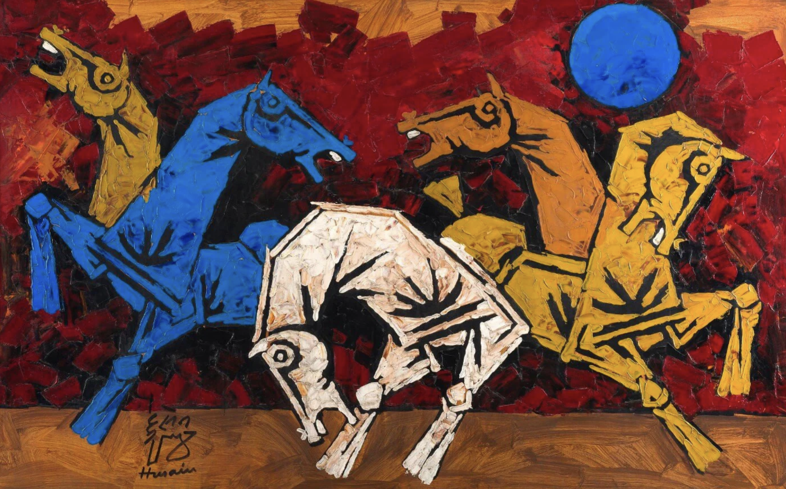

 

---

 ## Hi, I'm Sameer Ghawana

  

* 📖 M. Tech in Artificial Intelligence @ [Indian Institute of Science, Bangalore](https://ai.iisc.ac.in/mtechai/). 
* 📖 B. Tech in Electrical and Electronics Engineering  @ [Indian Institute of Technology, Guwahati](https://www.iitg.ac.in/eee/).
  
* 🎓 Research on **Machine Unlearning in Generative Models** @ [the IACV Lab](https://sites.google.com/iisc.ac.in/somabiswas/iacv-lab-iisc).

---

## 🖥️ Projects
<table width="100%">
  <tr>
    <th style="text-align: center; width: 50%;">Natural Language Processing</th>
    <th style="text-align: center; width: 50%;">Computer Vision and Image Processing</th>
  </tr>
  <tr>
    <td>
      <table width="100%">
        <tr>
          <th style="width: 70%; text-align: left;">Title</th>
          <th style="width: 30%; text-align: left;">Tags</th>
        </tr>
        <tr>
          <td><a href="#">Dummy NLP Project</a></td>
          <td>Python, NLTK</td>
        </tr>
      </table>
    </td>
    <td>
      <table width="100%">
        <tr>
          <th style="width: 70%; text-align: left;">Title</th>
          <th style="width: 30%; text-align: left;">Tags</th>
        </tr>
        <tr>
          <td><a href="#">Dummy CV Project</a></td>
          <td>Python, OpenCV</td>
        </tr>
      </table>
    </td>
  </tr>
</table>

<table>
  <tr>
    <th style="text-align: center;">Miscellaneous</th>
  </tr>
  <tr>
    <td>
      <table width="100%">
        <tr>
          <th style="width: 70%; text-align: left;">Title</th>
          <th style="width: 30%; text-align: left;">Tags</th>
        </tr>
        <tr>
          <td><a href="#">Dummy NLP Project</a></td>
          <td>Python, NLTK</td>
        </tr>
      </table>
    </td>
</table>

---

## Paper Implementations: 

## 1. 🔠 Natural Language Preocessing and LLMs

<table width="100%">
   <tr>
      <th width="30%">Title</th>
      <th width="10%">Repo</th>
      <th width="45%">Description</th>
      <th width="15%">Tags</th>
   </tr>
   <tr>
      <td width="30%" align="center"><a href="https://arxiv.org/pdf/1301.3781">Efficient Estimation of Word Representations in Vector Space (2013)</a></td>
      <td width="10%" align="center"><a href="">Link</a></td>
      <td width="45%" align="center"> Introduced word2vec (CBOW and Skip-gram) to learn word embeddings that capture semantic relationships of words</td>
      <td width="15%" align="center">NLP Word Embeddings Word2vec</td>
   </tr>
   <tr>
      <td width="30%" align="center"><a href="https://arxiv.org/pdf/1508.07909v5">Neural Machine Translation of Rare Words with Subword Units (2015)</a></td>
      <td width="10%" align="center"><a href="">Link</a></td>
      <td width="45%" align="center"> Introduced BPE Algorithm for sub-word tokenization</td>
      <td width="15%" align="center">NLP Tokenization</td>
   </tr>
   <tr>
      <td width="30%" align="center"><a href="https://arxiv.org/pdf/1409.0473">Neural Machine Translation by Jointly Learning to Align and Translate (2016)</a></td>
      <td width="10%" align="center"><a href="">Link</a></td>
      <td width="45%" align="center"> Introduced attention for first time in RNN seq2seq architecture</td>
      <td width="15%" align="center">NLP Attention RNN seq2seq</td>
   </tr>
   <tr>
      <td width="30%" align="center"><a href="https://arxiv.org/pdf/1706.03762">Attention is all you need (2017)</a></td>
      <td width="10%" align="center"><a href="https://github.com/sghawana/transformer-from-scratch">Link</a></td>
      <td width="45%" align="center">First Paper that proposed Transformer architecture to perform sequence to sequence mapping</td>
      <td width="15%" align="center">NLP Transformers seq-2-seq</td>
   </tr>
</table>

## 2. 🌄 Image Processing, Computer Vision & Generative Models

<table width="100%">
   <tr>
      <th width="30%">Title</th>
      <th width="10%">Repo</th>
      <th width="45%">Description</th>
      <th width="10%">Tags</th>
   </tr>
   <tr>
      <td width="30%" align="center"><a href="https://link.springer.com/article/10.1023/B:VISI.0000029664.99615.94">Distinctive Image Features from Scale-Invariant Keypoints (2004)</a></td>
      <td width="10%" align="center"><a href="https://github.com/sghawana/Image-Feature-Extraction">Link</a></td>
      <td width="45%" align="center"> The original SIFT paper. Describes method for extraction of image features(deterministically), which are invariant to changes in scale, rotation, and illumination</td>
      <td width="15%" align="center">Img Processing Feature Extraction</td>
   </tr>
   <tr>
      <td width="30%" align="center"><a href="https://people.eecs.berkeley.edu/~malik/papers/SM-ncut.pdf">Normalized Cuts and Image Segmentation (2000)</a></td>
      <td width="10%" align="center"><a href="https://github.com/sghawana/Image-Segmentation-by-classical-methods">Link</a></td>
      <td width="45%" align="center"> Proposes an approach to image segmentation by framing it as a graph partitioning problem and introduces an algorithm to achieve that</td>
      <td width="15%" align="center">Img Processing Segmentation</td>
   </tr>
    <tr>
      <td width="30%" align="center"><a href="https://arxiv.org/pdf/1411.4038">Fully Convolutional Networks for Semantic Segmentation (2014)</a></td>
      <td width="10%" align="center"><a href="https://github.com/sghawana/Image-segmentation-by-pretrained-ResNet50">Link</a></td>
      <td width="45%" align="center"> Proposes FCN architecture for the purpose of Image segmentation</td>
      <td width="15%" align="center">CV CNN Segmentation</td>
   </tr>
    <tr>
       <td width="30%" align="center"><a href="https://ieeexplore.ieee.org/document/726791">Gradient-based learning applied to document recognition (2014)</a></td>
       <td width="10%" align="center"><a href="https://github.com/sghawana/lenet-5-with-depthwise-convolution">Link</a></td>
       <td width="45%" align="center"> Proposes Le-Net architecture for the purpose of Document character recogonition</td>
       <td width="15%" align="center">CV CNN Object detection</td>
    </tr>
</table>
